# Citewise Postgraduate Research Management Application

## Overview

CiteWise is a mobile postgraduate research management application that streamlines student–consultant interactions. The app:

- Provides students with clear, timely service delivery and progress visibility via their mobile devices.

- Helps consultants manage their workload, communicate with students, and deliver annotated feedback efficiently.

- Equips admins with dashboards and performance analytics to improve decision-making and service quality.
- 
## Group Members
- Akhilesh Parshotam - ST10281011
- Erin Chisholm - ST10279615
- Connor Tre Van Buuren - ST10275455
- Ethan Ruey Huntley - ST10399453
- Alicia Orren - ST10265835

## Features

### User Authentication
- Secure login and registration using Firebase Authentication
- Password recovery functionality
- User profile management
- Mobile-friendly UI for authentication and profile screens.


### Role-Based Features

## Student Features

### 1. Student Dashboard
- Displays a list of all service requests the student has submitted.

- Each request shows key information such as:
  
    - Service type

    - Title

    - Priority/urgency

    - Date submitted

    - Deadline

    - Status

- Students can view feedback and annotated documents uploaded by the consultant for each request.

- Designed for mobile: scrollable cards and compact layouts for quick overview on phones.

### 2. Request a Service Page
- Allows students to submit a new service request from their mobile device.

- Students can:

  - Enter request details (service type, title, description).

  - Upload a document (e.g., proposal, chapter draft).

  - Set urgency and deadline using mobile-friendly controls (e.g., date picker).

- Once submitted:

  - The request appears on the Student Dashboard.

  - The request is visible in the View All Submitted Requests page.


### 3. View All Submitted Requests Page
- Shows a full list of all the student’s requests in one place.
- Students can filter requests by urgency: **High**, **Medium**, or **Low**.
- Helps students quickly find and track specific requests based on how urgent they are.

### 4. Resources Page
- Students can view a list of resources uploaded by the admin (e.g., guides, templates, documents).
- Each resource can be opened or downloaded.
- Resources can be filtered by **faculty** to show only relevant content.
- A search function allows students to search for resources by document name.

## Consultant Features

### 1. Consultant Dashboard
- Displays all service requests assigned to the consultant.
- Each request shows key information such as service type, title, date submitted, deadline, urgency and current status.
- Includes a **Workload Priority** summary that shows the percentage of assigned tasks by urgency level 
- Helps consultants quickly understand their current workload and which tasks are most urgent.

### 2. View All Tasks Page
- Shows a full list of all tasks/requests assigned to the consultant.
- Consultants can filter tasks by urgency: **High**, **Medium**, or **Low**.
- Makes it easier to focus on urgent tasks first or organise work by priority.

### 3. Request Details & Document Handling
- When the consultant clicks on an assigned request, they are taken to a detailed view of that request.
- The details page shows:
  - Student’s request information
  - Any additional notes provided by the student.
- The consultant can:
  - **Download** the document uploaded by the student.
  - **Upload** a new document back to the student.


## Admin Features

### 1. Admin Dashboard
- Displays an overview of the system, including:
  - Total number of registered students.
  - Total number of registered consultants.
- Admins can:
  - View a list of **pending consultants**.
  - Approve or reject consultant registration requests.
  - View a list of **approved consultants** currently active on the system.

### 2. Manage Consultants
- Allows the admin to assign consultants to student service requests.

- Helps ensure that service requests are distributed to the appropriate consultants based on availability and expertise.

### 3. Resources Page
- Admins can view all resources they have uploaded to the system.

  - Includes filtering options:

  - Filter resources by faculty.

- Search for a resource by name/title.

- Makes it easier to manage and maintain learning materials, guides, and templates.

### 4. Add Resource Page
- Allows the admin to add new resources to the system.

- The admin can:

  - Enter the title of the resource.

  - Select a category.

  - Select the faculty the resource belongs to.

  - Upload a file as the resource.

- Once added, resources become available to students on the Resources page.


## Screenshots

### Student Dashboard
<div style="display: flex; flex-direction: row; flex-wrap: wrap;">
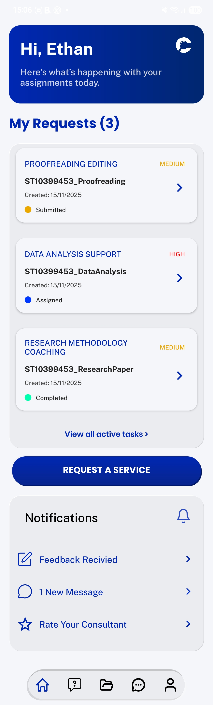 
</div>

 ### Student Submit Requests
<div style="display: flex; flex-direction: row; flex-wrap: wrap;">
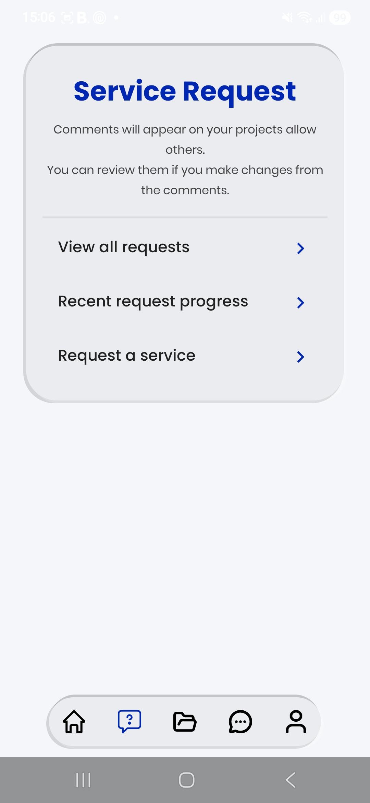
   
  
  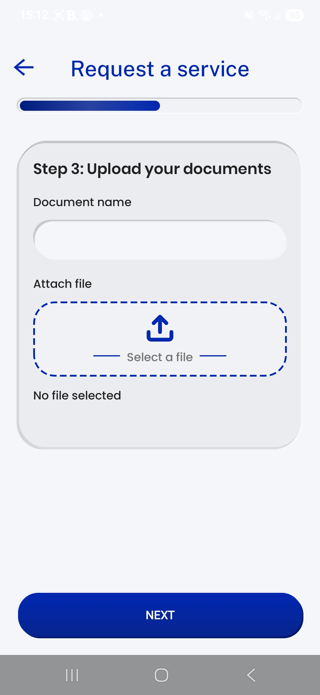
    

     
</div>

 ### Student View all Requests
<div style="display: flex; flex-direction: row; flex-wrap: wrap;">
 
</div>

 ### Student Resources
<div style="display: flex; flex-direction: row; flex-wrap: wrap;">
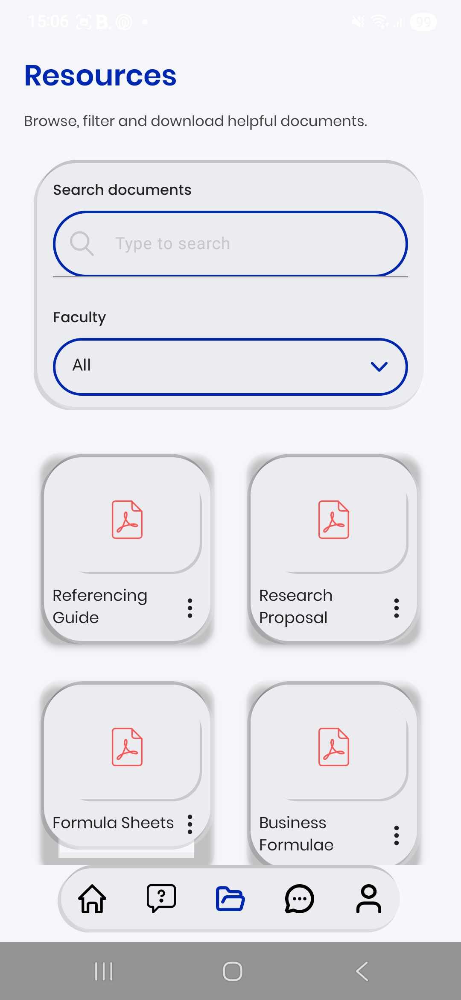 
</div>

  ### Consultant Dashboard
<div style="display: flex; flex-direction: row; flex-wrap: wrap;">
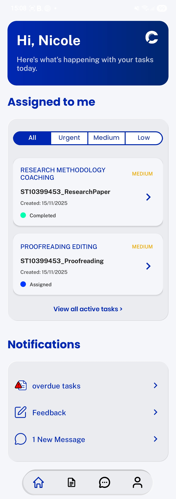 
</div>

  ### Consultant Assigned Tasks 
<div style="display: flex; flex-direction: row; flex-wrap: wrap;">
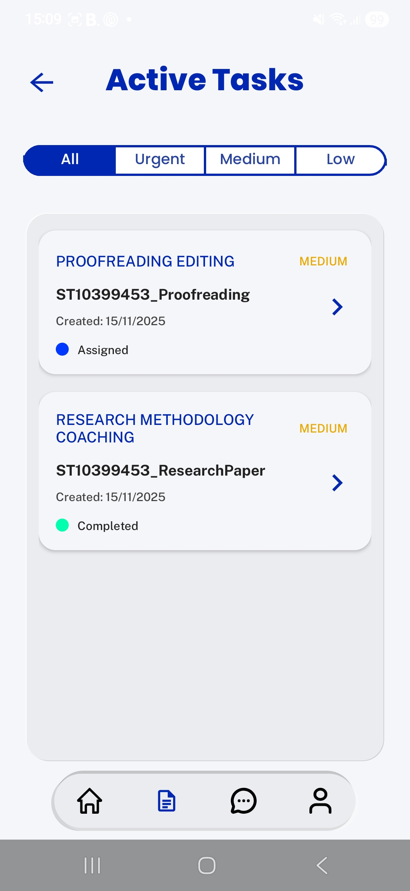 
</div>

   ### Consultant Provides Feedback
<div style="display: flex; flex-direction: row; flex-wrap: wrap;">

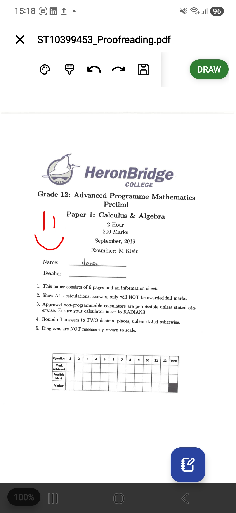
</div>

  ### Messages
<div style="display: flex; flex-direction: row; flex-wrap: wrap;">


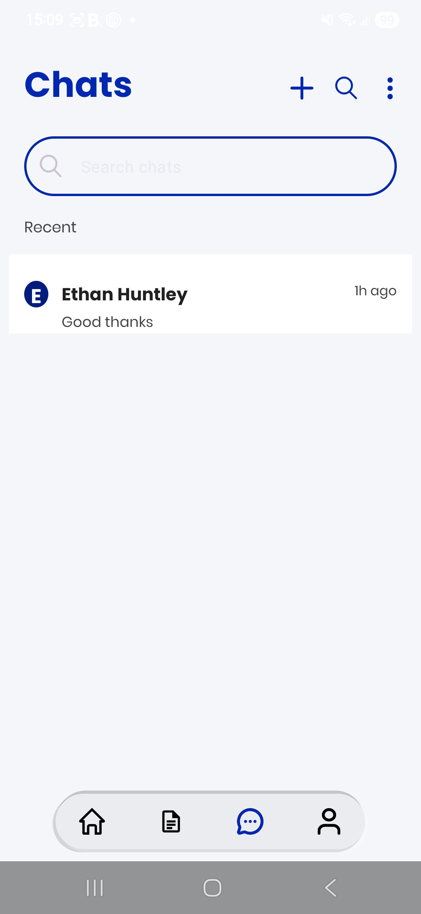
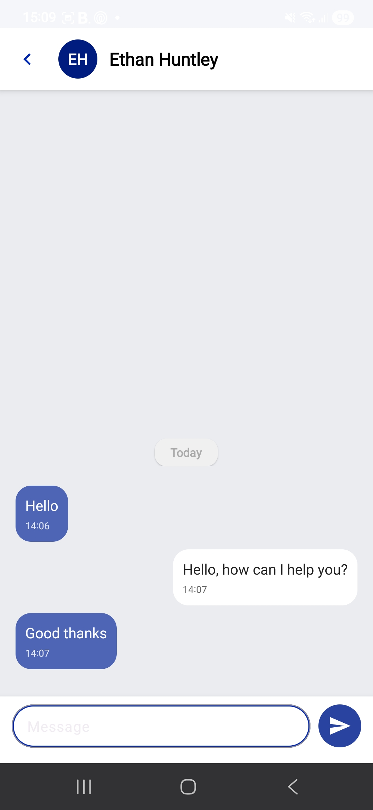
</div>

  ### Admin Dashboard
<div style="display: flex; flex-direction: row; flex-wrap: wrap;">

</div>


   ### Admin Assign Consultant
<div style="display: flex; flex-direction: row; flex-wrap: wrap;">
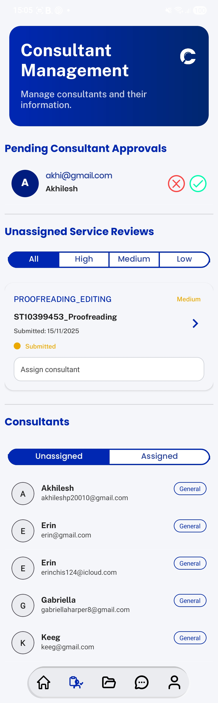

</div>

   ### Admin Resources
<div style="display: flex; flex-direction: row; flex-wrap: wrap;">
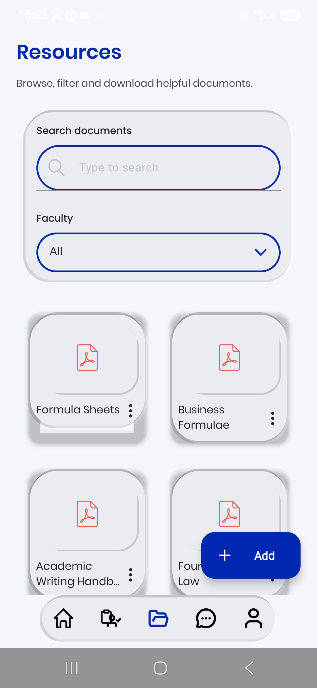
</div>

   ### Admin Add Resources
 <div style="display: flex; flex-direction: row; flex-wrap: wrap;">
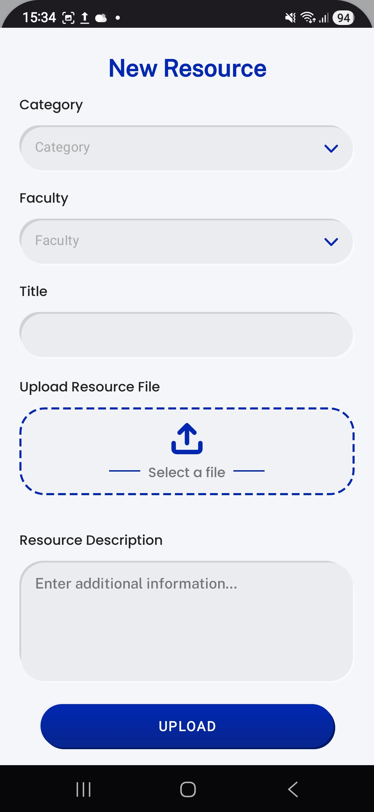
</div>


## Setup Instructions

### Prerequisites
Before setting up, ensure you have the following installed:

- Android Studio Narwhal Patch 4

- Windows 10 or later

- Android SDK and an Android emulator or a physical Android device

### Installation Steps
1. Clone or download the project repository.

2. Open Android Studio.

3. Select “Open an existing project” and choose the CiteWise project folder.

4. Allow Android Studio to sync Gradle and download required dependencies.

5. Connect an Android device (with USB debugging enabled) or start an Android emulator.

6. Click Run in Android Studio (or press Shift + F10) to build and install the app on your device/emulator.

## Links

### CiteWise Platform Walkthrough
[](https://youtu.be/_yIdpGbDg2M)

**Back up access:** 

- https://drive.google.com/uc?id=1AON-3u5ABLNzXCVUjiqaPlrY1r_k9R4z&export=download


Developed by Ethan Ruey Huntley, Akhilesh Parshotam, Connor Tre Van Buuren, Erin Chisholm, and Alicia Orren
```
