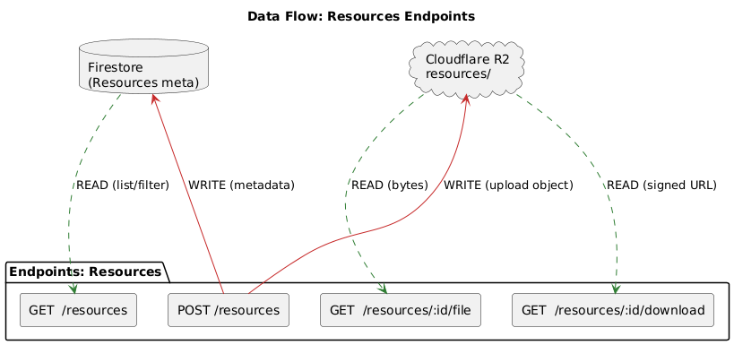
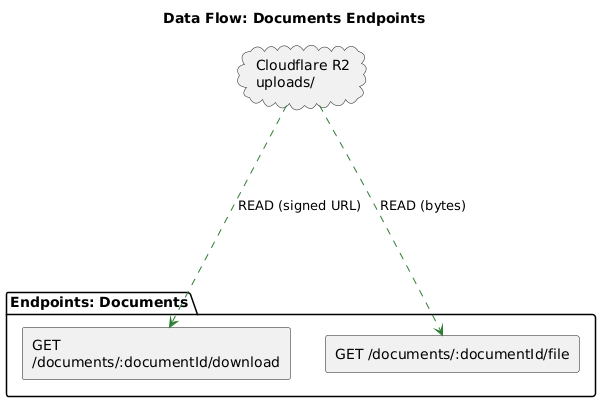
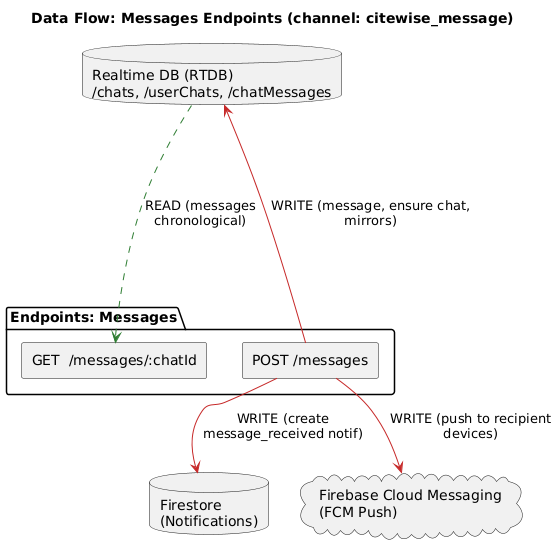

# CiteWise API

## Endpoints
**<ins>Service Requests</ins>**

  

1. **POST** /requests - Create a new service request (status: Submitted). 

2. **GET** /requests - Retrieve all service requests (filterable by status, student, consultant). 
3. **GET**/requests/:{id} - Retrieve details of a single service request. 
4. **POST** /requests/:{id}/assign – Admin assigns consultant and sets deadline (Submitted  to 
Assigned) 
5. **PUT**  /requests/:{id}/assign - Update or reassign consultant/deadline for an existing 
request. 
6. **POST** /requests/:{id}/start-review - Consultant starts reviewing the assigned request 
(Assigned → In Review). 
7. **POST** /requests/:{id}/review - Consultant submits outcome (approve → Feedback, reject 
→ Pending, fail → Failed). 
8. **POST** /requests/:{id}/resubmit - Student resubmits corrected work after rejection 
(Pending to Assigned). 
9. **POST** /requests/:id/cancel – Cancel request at anytime

**<ins>Documents</ins>**

  

 1. **GET** /documents/:{documentId}/download – Generate a signed download URL for a document (R2 or Azure). 

2. **GET** /documents/:{documentId}/file – Stream the document file directly (for in-app 
viewing).

**<ins>Resources</ins>**

  

1. **POST** /resources – Admin uploads a resource file (Writing Guide, Template, or AI Usage). 
2. **GET** /resources – Retrieve list of available resources (filterable by faculty, category, 
visibility). 
3. **GET** /resources/:{id}/download – Generate a signed download URL for a resource file. 

4. **GET**/resources/:{id}/file – Stream a resource file directly (for in-app viewing). 

**<ins>Messages</ins>**

  

1. **POST** /messages – Send a new chat message (creates chat if missing, stores in RTDB, 
notifies user via Firestore + FCM). 

2. **GET** /messages/:{chatId} – Retrieve all chat messages for a conversation, sorted in 
chronological order (oldest to newest.
## Links
### CiteWise API Explanation Video

**Back up access (Google Drive):** 
- https://drive.google.com/uc?id=1L__oRTRla7arhaHhM97uzOiSp4aqzLUH&export=download
